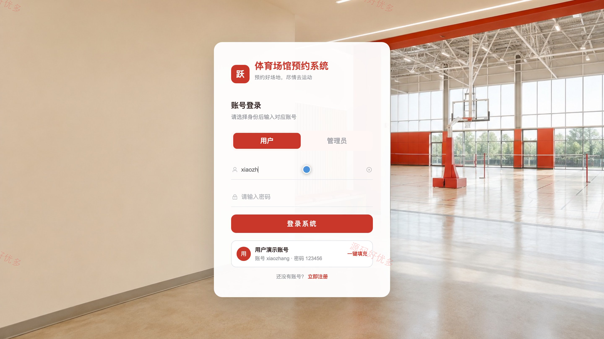
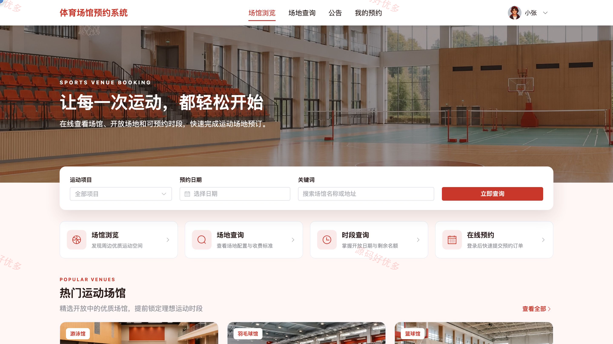
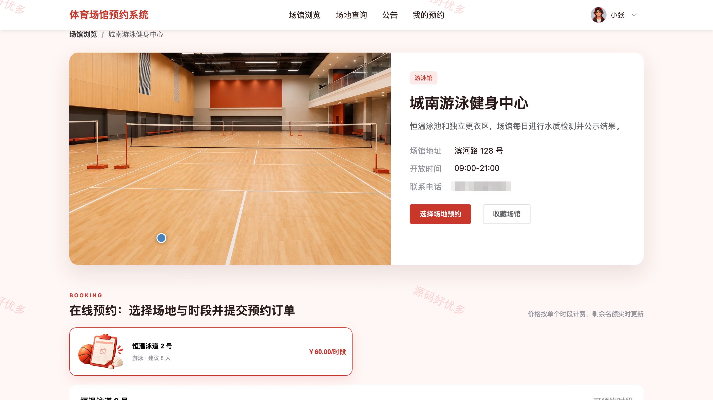
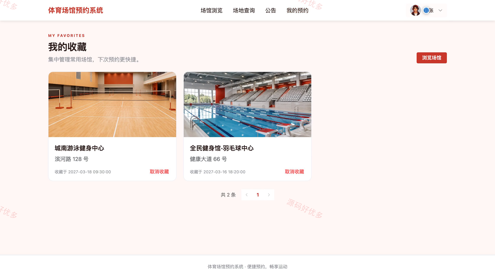
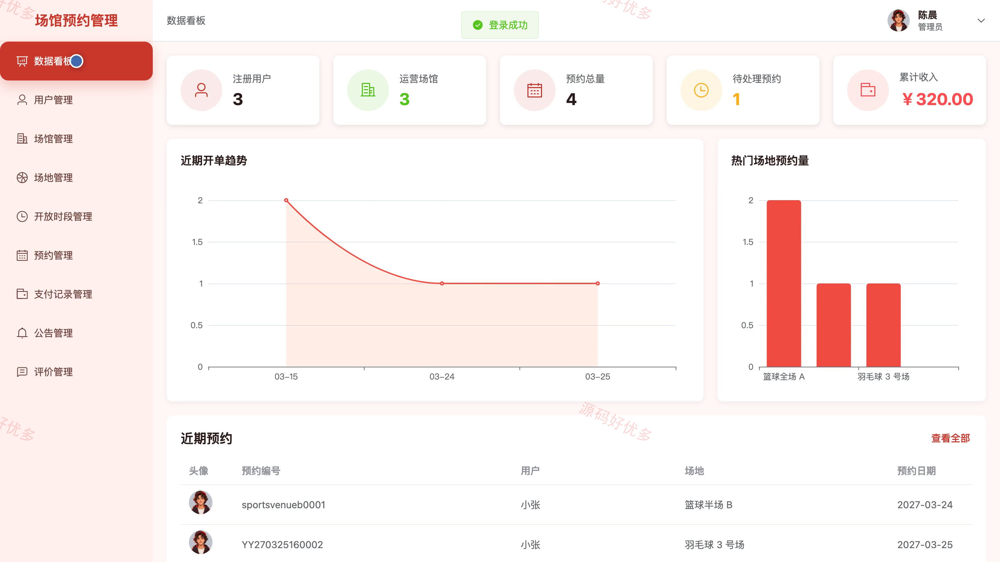
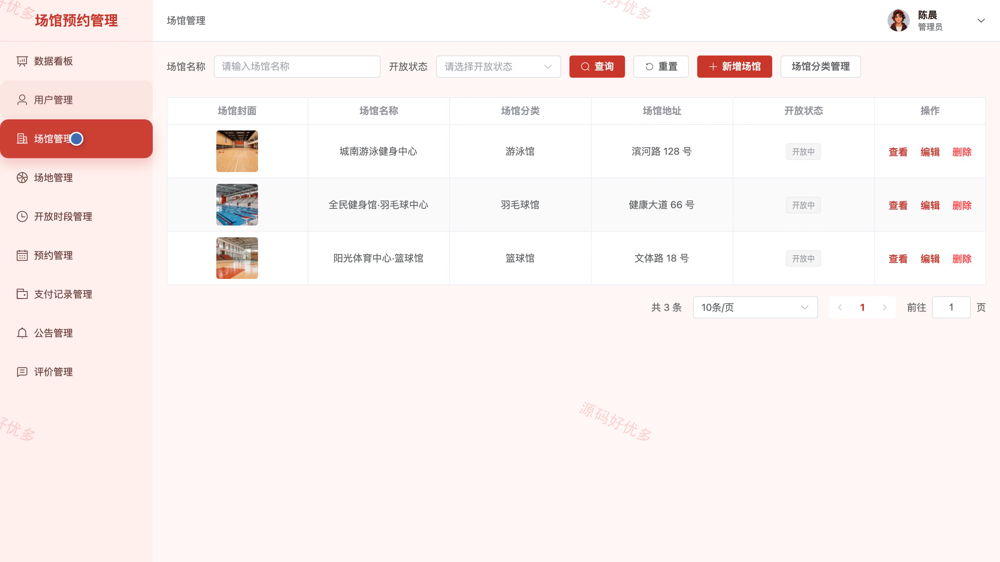
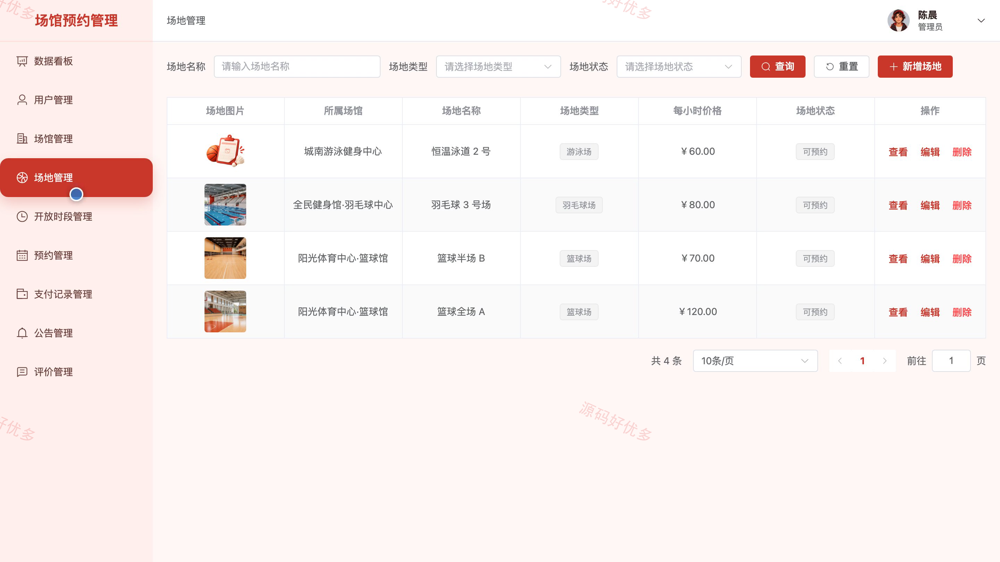
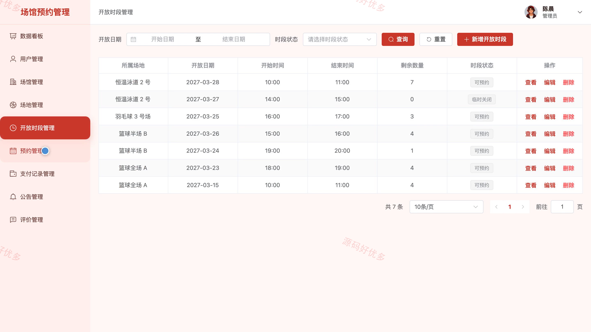

# bs117A
bs117A体育场馆预约系统
## 源码问题查看主页咨询

### 一、关键词
体育场馆预约、运动场地预订、球场时段预约、健身场馆服务、场地资源调度

### 二、作品包含
源码+数据库+万字设计文档+PPT+全套环境和工具资源+本地部署教程

### 三、项目技术
前端技术： Html、Css、Js、Vue3.4、Element-Plus
后端技术：Java、SpringBoot3.2.0、MyBatis-Plus

### 四、运行环境要求
开发工具：IDEA/eclipse + VSCODE

数据库：MySQL5.7+（共11张表）

数据库管理工具：Navicat10以上版本

环境配置软件： JDK17 + Maven3.6

前端Nodejs：20.20.2

浏览器：谷歌浏览器

### 五、项目介绍
项目编号：bs117A

本系统面向体育场馆日常预约与资源调度，用户可浏览场馆和场地、查询开放时段余量、在线预约与支付，并管理收藏、评价和个人资料；管理员可维护用户、场馆、场地、开放时段、预约、支付、公告与评价数据，并通过数据看板掌握运营情况。

角色：用户、管理员

用户功能：场馆浏览与分类筛选、场地详情与收费标准和开放时间查询、日期时段余量查询与在线预约、预约费用支付与取消支付、我的预约进度查询与限时取消、常用场馆收藏管理、预约完成后的评分评价、个人资料与密码维护。

管理员功能：用户账号查询与启停、场馆分类信息地址及联系方式维护、场地类型收费标准及启用状态维护、开放时段预约数量及临时闭馆设置、预约确认拒绝入场及完成登记、支付与退款记录查询、公告发布和管理、评价回复上下架及业务数据统计。

### 六、运行截图

